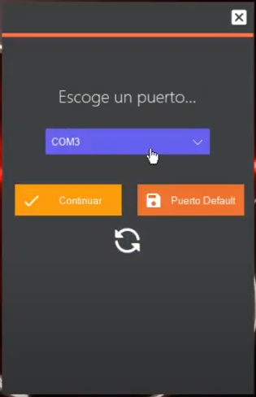
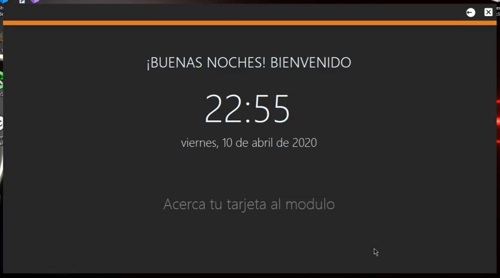
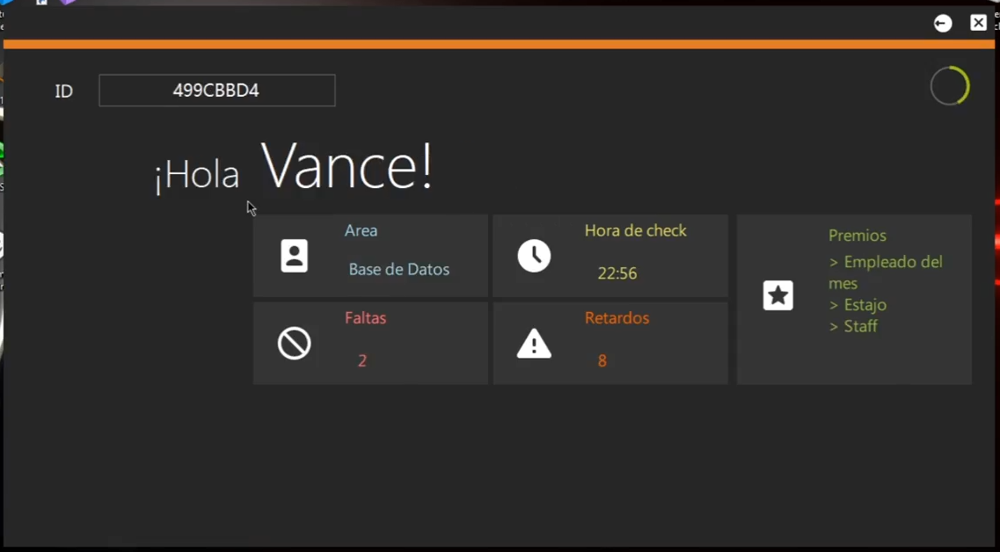
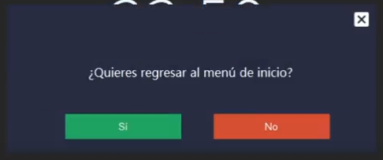

# BrainTech - Control de Empleados

Aplicación en C# que trabaja en conjunto con un Arduino y un modulo lector de tarjetas RFID para el registro de entradas y salidas de empleados de BrainTech.

## Acerca de nosotros

BrainTech es una empresa de desarrollo de software que se encarga de diseñar soluciones empresariales a petición.

> Contamos con un equipo especializado de programadores que abarcan diversos lenguajes de programación para extendernos a todo el mercado actual, ya que siempre se necesita una solución que puede ser especifica o requerir de más de un lenguaje para crear la solución.

La misión, visión y política de calidad de la empresa son factores importantes que se tienen claros en BrainTech para ser una opción sólida para nuestros clientes.

## Aplicación en funcionamiento

El menú inicial presenta una lista donde se presentarán los puertos de comunicación donde se detecten dispositivos conectados en la computadora. Se seleccionará el puerto donde esté conectado la placa Arduino. El listado se podrá refrescar pulsando el icono de las flechas.
Se podrá guardar el puerto como predeterminado, haciendo que cada vez que inicie el programa se seleccione el puerto guardado automáticamente de entre la lista, listo para continuar.

  

La pantalla principal será la vista que el usuario observara siempre, mostrando un breve saludo junto con la fecha y hora actual.

  

Esta pantalla cambiara cada que el módulo RFID lea correctamente la tarjeta del usuario, mostrando así la pantalla de registro donde se observaran datos del propio empleado.

  

Si es requerido se podrá regresar al menú principal para elegir un nuevo puerto de comunicación pulsando el icono del círculo con flecha en la parte superior de la pantalla principal. Esto desplegara un cuadro de dialogo de confirmación.

  

